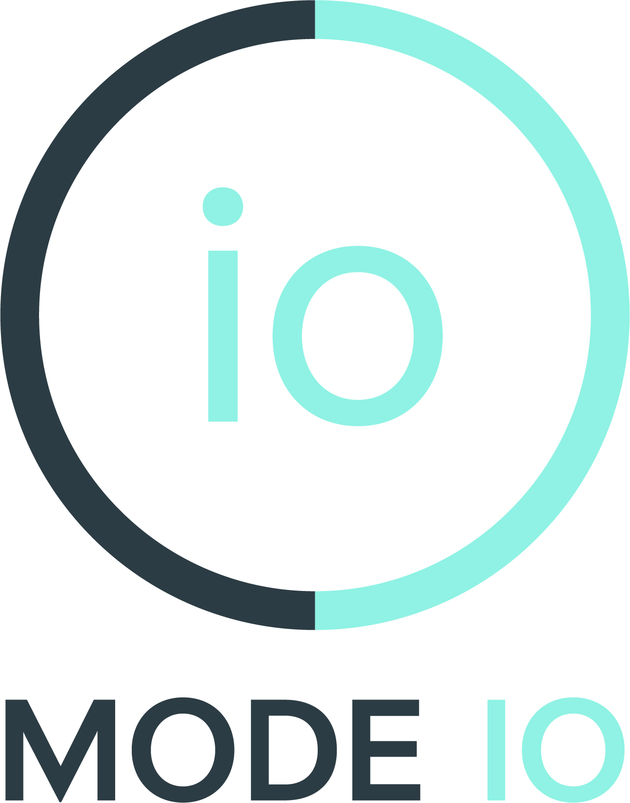

<div align="center">

<p align="center">
  <picture>
    
  </picture>
</p>
<h1>Mode IO.AI: Dynamic Privacy & Compliance Protector</h1>


</div>


<p align="center">
  <a href='https://www.modeio.ai/'>
  </a> 
  <a href='https://www.modeio.ai/'>
  </a>
  <a href='https://github.com/modeioai/modeioAI_skills'>
  </a> 
  <a href="" target='_blank'>
  
  </a> 
</p>

# 😎 About Us

**Mode IO.AI** is your **dynamic privacy and compliance protector**. We provide privacy capabilities for HIPAA, GDPR, and similar compliance scenarios—helping you safely anonymize and redact personally identifiable information (PII) in data processing, cross-border transfers, and AI workflows.

This repo (**modeioAI_skills**) offers **Agent Skills** that integrate with Cursor and other AI environments. Through standardized skill descriptions and scripts, AI assistants can call the [Modeio API](https://www.modeio.ai/api/detector/anonymize) whenever anonymization, redaction, or PII removal is needed—processing sensitive content in text or JSON in a compliant way. **Every operation performs a real API request** (no caching), so results are auditable and traceable.

- 🌐 **Website:** [modeio.ai](https://www.modeio.ai/)
- 📦 **Capabilities:** PII detection & anonymization, compliance-ready redaction, data protection for cross-border use cases
- 🤖 **This repo:** Skills and scripts that tell AI agents when and how to call Modeio, so privacy protection fits seamlessly into your workflow

# 🚀 Quick Start

## 1. Use in Cursor or Claude Code

**Cursor**  
Add this repo as a **Cursor skill** so the AI can anonymize PII when you ask. Go to **Settings → Cursor Settings → Skills**, then add the path to your local `modeioAI_skills` folder (or the `modeioAI_anonymization` subfolder). The agent will use the [Modeio anonymization API](https://www.modeio.ai/api/detector/anonymize) when you say "anonymize", "redact PII", or "脱敏".

**Claude Code**  
Clone or add `modeioAI_skills` to your workspace so Claude can see the skill. Point Claude at `modeioAI_anonymization/SKILL.md` (e.g. with `@modeioAI_anonymization/SKILL.md` or by opening it in context). When you ask to anonymize or redact PII, Claude will follow the skill and call the API, or run `scripts/anonymize.py` with your input.

## 2. Run the anonymization script

From the repo root, anonymize text or JSON via the CLI:

```bash
# Inline text
python modeioAI_anonymization/scripts/anonymize.py --input "Name: John Doe, SSN: 123-45-6789"

# From a file
python modeioAI_anonymization/scripts/anonymize.py --input "$(cat sensitive_data.json)"
```

Requires Python 3 and `requests` (`pip install requests`). Output is printed to stdout; PII is replaced with `[REDACTED_*]`-style tokens.

For full API and skill details, see [modeioAI_anonymization/SKILL.md](modeioAI_anonymization/SKILL.md).

